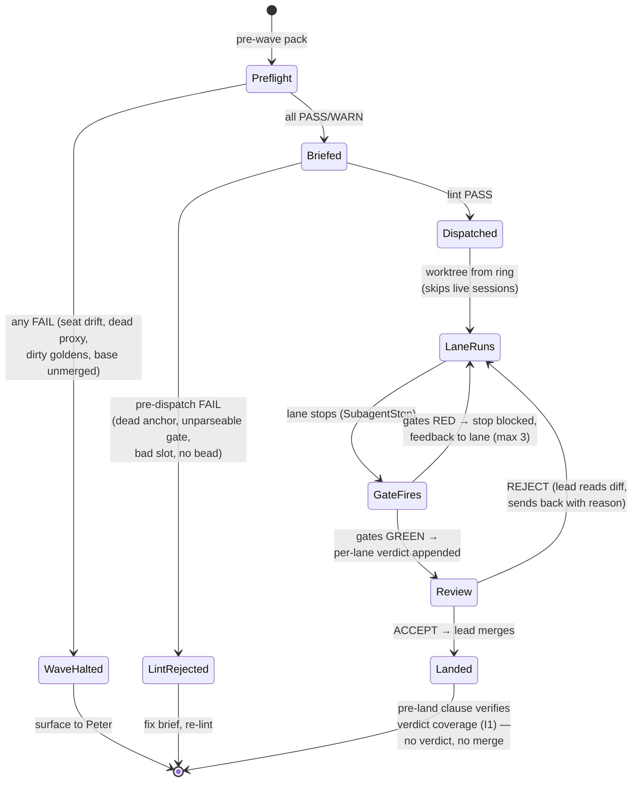

# Gate Runtime — verdicts the machine writes, not claims the lanes make

**Status:** SHIPPED 2026-07-25 (L1) — P1–P5 on main (core, pre-wave, linter, pre-land clause + report with the I1 verdict-before-merge hook, SubagentStop firing) plus same-day follow-up fixes, all in beads/git. AMENDED 2026-07-27: D9 gaming scan + fail-streak directive, D10 trail-as-counter + hook-liveness pre-wave checks (Peter + Fable). Owed: P5 SubagentStop live-fire confirm — first executor lane in a new session; payload log `/tmp/manifold_subagent_stop_payloads.jsonl` is the trail. · k3 (lead)
**Prerequisites:** none. Self-hosts from P1 onward (P2+ land under their own verdicts).
**Execution contract:** read docs/DESIGN_DOC_STANDARD.md section 5 (Phase briefs)–section 6 (Seam briefs — refactors and API changes) before starting any phase.

The wave IR (`docs/SEMANTIC_WORKFLOW_PROGRAMS.md` section 2 (The wave IR — the concrete instance we already run)) already names the missing piece: `GATE : Diff -> exit codes [runtime — zero model]`. Today that opcode doesn't exist as machinery — a lane's "green" is a prose claim, and the lead's only verification is re-running the gate or trusting the claim. This design builds GATE as a runtime: one script that executes gates itself, writes typed verdicts to an append-only trail, and fires at four lifecycle points. It is the first component where **the machine, not an agent, says what happened** — the proof of concept for the semantic instruction set. The six proposals from the 2026-07-25 discussion (gate runner, seat preflight, brief linter, verdict-before-merge, wave report, beads queue) are one mechanism with four packs plus a query, not six tools.

Companion docs: `docs/SEMANTIC_WORKFLOW_PROGRAMS.md` (the IR this implements — GATE, plus the soft→hook migration program of section 3 (The enforcement table — the key analytical tool)/section 9 (Open questions / next steps)) · `docs/AGENT_ROUTING.md` (the running roster this serves) · `.claude/orchestration/rt-reflections-r2-queue.md` (R2's pre-flight already carries two items this design subsumes mechanically: verdict rationale, gate discipline).

## 1. Audit — what exists (verified 2026-07-25, main @ e692762c)

| Piece | Where | State |
|---|---|---|
| Deny-capable hook pattern | `.claude/hooks/agent-launch-guard.py`, `agent-tier-spawn-guard.py`, `worktree-guard.py` | exists — PreToolUse hooks deny with spelled-out fixes |
| Two-tier gate pattern (deny-once + re-check) | `.claude/hooks/workflow-gate.py` | exists — precedent for P4's merge clause |
| Blocking idle hook (feedback to lane) | `.claude/hooks/lane-report-enforcer.py` | exists — TeammateIdle can block; proves hooks steer lanes mid-flight |
| Bash interception point | `.claude/hooks/preToolUseBash.py` (+ `test_preToolUseBash.py`) | exists — P4's merge clause is one rule here, not a new hook |
| Slot truth source + drift flags | `scripts/seat_tool.py` (`show` prints per-slot drift) | exists (e692762c) — preflight pack shells out to it |
| Quota/liveliness reads | `~/.claude/statusline.sh` (kimi usage API), litellm `/health/liveliness` | exists — lift, don't reinvent |
| SubagentStop / TaskCompleted hook support | claude binary 2.1.219 (`strings`: `SubagentStop`, `executeTaskCompletedHooks`) | exists — ⚠ VERIFY-AT-IMPL: payload semantics undocumented; probe in P5 |
| Verdict store | — | **genuinely new** |
| Gate executor | — | **genuinely new** |
| Brief anchor checker | — | **genuinely new** |
| R2 verdict-rationale rule | `.claude/orchestration/rt-reflections-r2-queue.md` pre-flight | exists as *lead discipline*; this design mechanizes the gate half, the REVIEW-rationale half stays lead discipline (D8) |

Extend, don't redesign: every firing point is an existing hook; the only new systems are the runner and the trail.

## 2. Decisions

**D1 — One mechanism, four packs.** `scripts/gate_runner.py` is the single artifact. A *pack* is a named set of checks fired at a lifecycle point: `pre-wave` (seat/config preflight), `pre-dispatch` (brief lint), `per-lane` (the brief's own gates), `pre-land` (verdict coverage). Rejected: six standalone tools (Opus's list as six scripts) — six CLIs drift independently; the point is that one trust boundary writes one trail.

**D2 — The trust boundary: lanes never write verdicts.** gate_runner *executes* the gate command itself (subprocess, timeout, captured exit + output tail) and writes the verdict. Lane prose, lane-run "gate output", and lane-written JSON are all ignored. Rejected: lanes emit verdict JSON the lead validates — that is self-report in a typed costume, the exact bug being killed.

**D3 — Trace identity = the bead id.** Task, branch, verdict filename, and commit trailer all carry the existing `BUG-xxx`. Rejected: a new trace-id scheme — DESIGN_AUTHORING section 3's zero-new-systems test; beads is the identity system. A lane task with no bead gets one created at brief time; that's already the single-writer discipline.

**D4 — Firing points, and what fires them.** `per-lane`: SubagentStop hook (P5) — binary-verified present; until P5 lands, the lead runs `gate_runner per-lane` at review (the current manual path, formalized). `pre-land`: one clause in `preToolUseBash.py`. `pre-wave`/`pre-dispatch`: explicit wave step-0 commands — NOT SessionStart hooks, because preflight is wave-scoped and a session may host zero or two waves.

**D5 — Verdict schema v1 (the seam; committed, not sketched).** Append-only JSONL at `.claude/orchestration/verdicts/<task>.jsonl`:

```json
{"schema": 1, "task": "BUG-xxx", "phase": "pre-wave|pre-dispatch|per-lane|pre-land",
 "brief": "<path>#<anchor>", "branch": "lane/...", "commit": "sha|null",
 "gates": [{"cmd": "...", "exit": 0, "duration_s": 12.3, "tail": "last 20 lines"}],
 "scope": {"files_changed": ["..."], "in_scope": true},
 "pass": true, "kind": "gate|no-gate", "reason": "required iff kind=no-gate",
 "runner": "gate_runner.py@<subagent-stop|lead|preflight|lint>", "ts": "..."}
```

`kind: no-gate` is the explicit bypass (docs-only landings, hook-only changes): the bypass is a verdict too, with a mandatory `reason`. JSONL, not JSON — append-only by construction; nothing ever rewrites history.

**D6 — Pre-land coverage rule.** `git merge --no-ff` to main requires, for every bead task named on the branch, a passing verdict (gate or no-gate) against the branch tip. The clause lives in `preToolUseBash.py`, shaped like workflow-gate's two-tier deny (violation denies with the missing verdicts spelled out). Consequences, stated honestly: this adds friction to small landings — a doc typo fix to main now needs a one-line no-gate verdict. That's seconds with `gate_runner no-gate --task BUG-xxx --reason "typo"`, and the alternative is the silent-bypass hole the rule exists to close.

**D7 — Wave report is a query, not a store.** `gate_runner report --wave <label>` counts verdicts, beads closes, and decisions.md entries between two refs/dates. Anything it can't compute from the trail is a trail gap, not a report feature.

**D8 — REVIEW rationale stays lead discipline (for now).** The R2 queue's "every REVIEW verdict appends one line to decisions.md" is the lead's judgment record, not a gate output. This design does not mechanize it; gate verdicts and review verdicts are different types and conflating them is how the trail fills with machine noise around the one human-tier signal. Revive as machinery only if R2 shows the discipline slipping.

**D9 — Green earned by weakening the gate is red (added 2026-07-27, Peter + Fable).** A gate is only safe to automate if failing it loudly is cheap and legitimate; the moment green is the only acceptable lane outcome, the incentive is to fake it. Two mechanisms in `per-lane`, tested in `scripts/test_gate_runner_gaming.py`: (a) *gaming scan* — the lane diff (merge-base..commit, Rust hunks only; commit = `--commit`, else the `--branch` tip, else the single worktree slot whose unlanded commits name the task id — never cwd HEAD, and ambiguity skips the scan rather than guessing) is scanned for net-removed `assert`/`#[test]` lines and any added `#[allow(`/`#[ignore]`; each signal is a failing gate entry in the verdict, so the diff that deleted the failing test goes red for a named reason instead of green. Legitimate cases (refactor, justified suppression) go through the lead with a reason — forcing that review is the point, not an accusation. (b) *fail-streak directive* — at `FAIL_STREAK_LIMIT` (3) consecutive red per-lane runs on a task, the runner's output orders the lane to stop retrying and deliver a blocked report; a clear blocked report is a successful lane outcome. The SubagentStop feedback path carries the directive back to the lane (it selects FAIL lines); `subagent-stop-gate.py`'s existing MAX_BLOCKS release remains the loop-breaker of last resort.

**D10 — One counter, plus a canary for fail-open (added 2026-07-27, Peter + Fable).** Two seams closed. (a) The stop-gate's block counter was a private `/tmp` state file keyed by agent id while gate_runner's stop-retrying directive counted trail verdicts — two counters over one fact, free to drift. Now the verdict trail is the only counter: `subagent-stop-gate.py` reads the task's trailing red streak from the trail gate_runner just appended to, and releases past `FAIL_STREAK_LIMIT` with the loud systemMessage. (b) Enforcement hooks fail open by design, so enforcement can evaporate silently — unregistered, deleted, or crashing on a changed payload shape. Pre-wave grows two liveness checks: `hooks registered` (every enforcement-suffixed hook file appears in `settings.json` and every registered command's file exists) and `hooks fire` (canary-fires `worktree-guard.py` with a synthetic main-checkout edit and requires the deny). A hook that stopped firing goes red at the next wave start instead of never.

The plausible-wrong turns, forbidden by name:

1. **You will want to build the driver script.** No. The standing note (SEMANTIC_WORKFLOW_PROGRAMS section 7, R1 handoff): "Do not build the driver without Peter." This design is the verdict layer only. The driver is a separate, Peter-gated decision.
2. **You will want lanes to emit verdict JSON.** No — D2. Self-report in a typed costume is still self-report.
3. **You will want a verdict database/dashboard.** No — JSONL + `rg` + the report query is the whole read path. A store is a second home for truth.
4. **You will want to retrofit verdicts onto R1 and older waves.** No — forward-only. Retrofitting manufactures data the waves never produced.

## 3. Invariants & enforcement

- **I1 — No landing without verdict coverage.** Enforcement: `preToolUseBash.py` merge clause (P4), tested in `test_preToolUseBash.py`.
- **I2 — Verdicts are written only by gate_runner.** Enforcement: PreToolUse Edit|Write guard on `.claude/orchestration/verdicts/` (P1 — two-line matcher clause); gate_runner itself appends via Python, never through the Edit tool.
- **I3 — Gate commands come from the brief, executed verbatim.** Enforcement: brief linter (P3) extracts and shell-parses every gate command; runner refuses inline ad-hoc gates at `per-lane` (cmd must match the brief's declared list).
- **I4 — Schema is versioned; unknown versions fail loud.** Enforcement: runner validates every append against schema 1; a verdict it can't parse is a stop, not a skip.

## 4. Phasing

Each phase is one session, Flash-executable: the seams are decided above; phases are transcription + the named gates. P1 lands first and P2+ self-host (each lands under its own verdict — the design's own proving wave).

### P1 — gate_runner core + verdict trail

- **Entry state:** main contains `scripts/seat_tool.py` (e692762c) and `.claude/orchestration/` exists. Verify: `scripts/seat_tool.py show` exits 0.
- **Read-back:** this doc's D1–D5, I1–I4; the workflow-gate two-tier pattern at `.claude/hooks/workflow-gate.py` (shape precedent).
- **Deliverables:** `scripts/gate_runner.py` with subcommands `per-lane --task --brief --branch --commit` (runs the brief's declared gates, appends verdict), `no-gate --task --reason`, `show --task`; verdicts dir + I2's Edit|Write guard clause in the guard hook; a `tests/` -style self-check script `scripts/gate_runner_selftest.sh`.
- **Gate:** selftest runs a known-pass gate (exit 0) and a known-fail gate (exit 1): jsonl validates against schema, `pass` fields correct, exit codes propagate, second appends don't rewrite line 1. `python3 -m json.tool` on each line. Negative gate: direct `Edit` of a verdicts file is denied by the I2 clause (probe with a scratch verdict).
- **Demo:** none — L1.
- **Forbidden moves:** lane-facing "validate my JSON" mode (D2); schema fields beyond D5 "just in case"; a README instead of docstring.

### P2 — pre-wave pack (seat preflight)

- **Entry state:** P1 landed (verdict on main). Verify: `git merge-base --is-ancestor <p1-sha> origin/main`.
- **Read-back:** D1, D4; `scripts/seat_tool.py` show output shape; the R2 queue's blocking pre-flight list (these checks subsume its mechanical half).
- **Deliverables:** `gate_runner pre-wave` checks, each a named PASS/FAIL line + one verdict: seat_tool drift (parse `show`, no `<- DRIFT`), litellm liveliness (200), per-seat quota read (lift the kimi usage call from statusline.sh; warn-only), goldens clean (`git status --porcelain tests/fixtures/gltf/goldens/` empty), wave base merged (`git merge-base --is-ancestor` per the queue's check).
- **Gate:** live run against the fleet prints all-PASS and exits 0; induced failure (preflight against `LITELLM_URL=http://127.0.0.1:9`) exits 1 naming the dead check.
- **Demo:** none — L1.
- **Forbidden moves:** SessionStart-hook auto-run (D4); hard-failing on quota percentage (warn-only — quota is information, not a gate); re-deriving slot state instead of calling seat_tool.

### P3 — pre-dispatch pack (brief linter)

- **Entry state:** P1 landed.
- **Read-back:** D1, I3; `.claude/hooks/agent-launch-guard.py` `slot_map()` (the valid-slot source, derived from session env); DESIGN_DOC_STANDARD section 3 (anchor rules).
- **Deliverables:** `gate_runner pre-dispatch --brief <path>`: every `file:line` anchor in the brief resolves (file exists, line in range); every gate command in the brief's Gates section shell-parses (`bash -n` equivalent); every named seat/slot is a valid slot label from the naming guard's `slot_map()`; the brief names a bead task matching `BUG-\w+`. Appends a `pre-dispatch` verdict per brief.
- **Gate:** lint `.claude/orchestration/rt-reflections-r2-queue.md` — a real, dense brief set; must PASS after any genuinely-stale anchor is reported to the lead (stale anchors in R2's queue are findings, not lint bugs). Synthetic broken brief (dead anchor, unparseable gate, bogus slot, no bead) must FAIL naming all four.
- **Demo:** none — L1.
- **Forbidden moves:** semantic lint (judging whether a conviction test discriminates — that's REVIEW, a model's job, IR section 4.3); hookifying the linter (deferred — needs a brief-file convention first); auto-fixing anchors.

### P4 — pre-land pack (merge clause) + wave report

- **Entry state:** P1 landed; `preToolUseBash.py` and `test_preToolUseBash.py` read.
- **Read-back:** D6, D7, I1; workflow-gate's deny-with-spelled-out-fix pattern.
- **Deliverables:** merge clause in `preToolUseBash.py` (I1) with the two-tier deny; `gate_runner report --wave <label> --since <ref>`; new test cases in `test_preToolUseBash.py`.
- **Gate:** tests pass: merge denied with missing-verdict list when uncovered; merge passes with passing verdicts at branch tip; merge passes with a `no-gate` verdict + reason. Report over R1's dates prints nonzero counts (decisions.md D-50..D-56 exist to be counted).
- **Demo:** none — L1.
- **Forbidden moves:** parsing git log for "task mentions" as coverage (coverage = verdict trail, D6); allowing `--no-verify`-style bypass flags; exempting "small" landings by diff size (D6's honest cost applies to everyone, lead included).

### P5 — SubagentStop firing (per-lane, harness-native)

- **Entry state:** P1–P4 landed. ⚠ VERIFY-AT-IMPL: SubagentStop payload fields — probe with a logging hook first (lane-report-enforcer.py's payload-logging is the precedent); if the payload can't identify the lane's task/branch, this phase escalates, does not improvise.
- **Read-back:** D2, D4; lane-report-enforcer.py (blocking-hook mechanics on a lane lifecycle event).
- **Deliverables:** SubagentStop hook that, for executor-tier lanes, runs `gate_runner per-lane` against the lane's brief and blocks the stop with the failure output if gates are red.
- **Gate:** spawn a test lane whose gate passes → stop allowed, verdict appended; test lane with a failing gate → stop blocked, feedback names the red gate; MAX_BLOCKS-style escape after 3 blocks (loud, not loop — precedent in lane-report-enforcer).
- **Demo:** none — L1.
- **Forbidden moves:** gating non-executor tiers (lead/dispatcher stops stay free); running gates the brief didn't declare (I3); treating a blocked stop as a failure to retry forever.

## 5. Decided — do not reopen

1. One runner, four packs (D1) — not six tools.
2. Lanes never write verdicts (D2) — the trust boundary is the design.
3. Trace id = bead id (D3) — no new identity system.
4. JSONL append-only trail at `.claude/orchestration/verdicts/` (D5) — no database.
5. Bypass = a `no-gate` verdict with a reason (D5/D6) — never silence.
6. REVIEW rationale is lead discipline, not machinery (D8).
7. The driver script is not in this design (forbidden turn #1) — Peter's call, separately.

## 6. Diagrams (added 2026-07-25, post-ship — Peter's request)

### The machine and its trust boundaries

```mermaid
flowchart LR
    subgraph JUDGMENT["Judgment seats (models)"]
        LEAD["Lead (k3)<br/>COMPILE_WAVE · REVIEW · LAND"]
        DISP["Dispatcher (glm-5.2)<br/>BRIEF · SCOPE_CHECK"]
        LANE["Executor lanes (Flash)<br/>EXECUTE: Brief → Diff"]
    end

    subgraph MACHINE["The machine (zero model)"]
        PW["pre-wave pack<br/>seat drift · liveliness · quota · goldens · base"]
        PD["pre-dispatch pack<br/>anchors · gates parse · slots · bead"]
        GR["gate_runner<br/>executes gates, writes verdicts"]
        SS["SubagentStop hook<br/>fires GR on lane stop"]
        PL["pre-land clause<br/>(preToolUseBash)"]
        VT[("verdict trail<br/>verdicts/*.jsonl<br/>append-only")]
        RPT["report<br/>(read-only query)"]
    end

    LEAD -->|"briefs (files)"| PD
    PW -->|"wave step 0"| VT
    PD -->|"lint pass/fail"| VT
    DISP --> LANE
    LANE -->|"one commit, stops"| SS
    SS -->|"runs brief's gates"| GR
    GR -->|"the ONLY writer (I2)"| VT
    PL -->|"coverage check"| VT
    LEAD -->|"git merge --no-ff"| PL
    RPT -->|"reads"| VT

    style VT fill:#1a3a1a,stroke:#4a4
    style LANE fill:#3a1a1a,stroke:#a44
```



The red zone never touches the green zone: **lanes produce diffs, never verdicts** (D2). The trail is written by exactly one process (gate_runner, I2 — Edit-guarded) and read by the merge clause, the report, and review.

### Wave lifecycle — the state machine



Every transition into a green state is machine-checked; every transition out of `Review` is lead judgment with the machine's evidence in hand. The two terminal escapes (`WaveHalted`, `LintRejected`) are loud by construction — silence is the bug this design exists to kill.

## 7. Deferred

- **Driver script** — revive only via Peter, per the standing note (SEMANTIC_WORKFLOW_PROGRAMS section 7).
- **fleet_doctor full drift audit** (profiles↔toml, docs index↔docs, board↔headers, memory pointers↔reality) — separate bead; P2's preflight is the wave-scoped subset, not the audit.
- **agent-worktree.py cwd anchoring** (nested-worktree bug observed 2026-07-25) — separate bead, small fix.
- **Hookified brief lint** (PreToolUse Agent deny) — revive when briefs are files by convention, not paste-into-prompt.
- **Hook migration list** (retry-cap, one-commit-then-stop) — already queued in R2's pre-flight; build deliberately per SEMANTIC_WORKFLOW_PROGRAMS section 9.
- **Plan-template library** — post-R2, per SEMANTIC_WORKFLOW_PROGRAMS section 7.
- **Lane metrics to Prometheus** (gate pass rates next to spend) — revive if the Grafana stack proves useful for spend; verdicts jsonl is the source.
